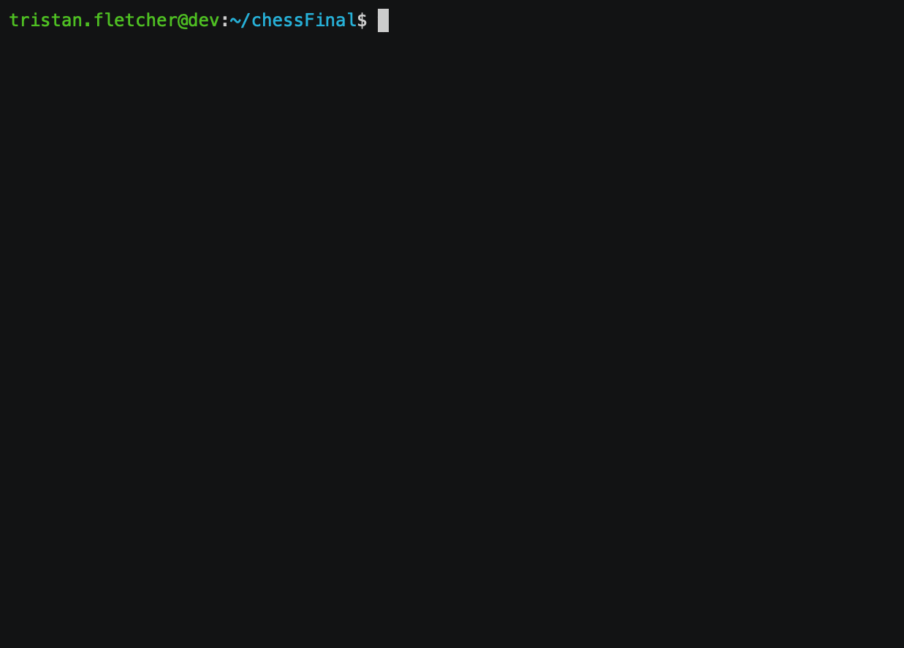

# ASMChess
_I thought I was already crazy, then I started this project_

## What is this?

This is Chess. Written in x86 assembly. Yeah, you read that correctly. Why? Because I wanted something cool to do for a final project.

## Show me!

Sure, here ya go.
