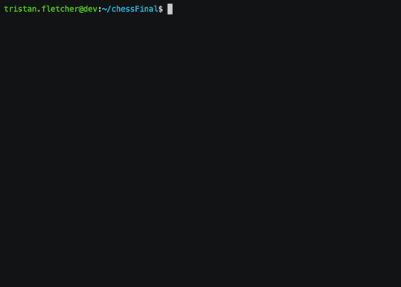

# ASMChess
_I thought I was already crazy, then I started this project_

## What is this?

This is Chess. Written in x86 assembly. Yeah, you read that correctly. 

Why? Because I wanted something cool to do for a final project.

Major props to [my professor](https://github.com/rewzilla) for having a helping hand throughout this process. Without your class, this wouldn't have even been possible for me to do. Thanks for listening to my insane ramblings on Slack and in office hours about this :)

There are a number of features implemented including:

* Basic movement for every piece
* Error checking for every. possible. move.
* Forced turn system (designed for one player to control capitals and one for lowercase)
* If a pawn reaches the opposite side of the board, it becomes a queen
* If the king is overwritten (captured), the game ends

Items not currently implented (feel free to pull request if you get one working)

_As of the current writing, I have no plans to add these features. Maybe in the distant future_

* En Passant
* Castling/Rooking
* Checkmate detection
* Tracking which pieces are taken off the field
* AI play

## Show me all the things!

Here's the general chess game, including moving each piece around to prove it works.

This shows a pawn being promoted to a queen when it reaches the end of the board.

_Note: I cheated and placed a pawn closer to the edge of the board. This works fine in normal gameplay, I just didn't want to go through a full sequence to show this._

## Questions, comments, ideas?

Feel free to reach out to me or submit a pull request! I don't bite, I promise.

[Contact me on Twitter](https://twitter.com/cyclawps52)